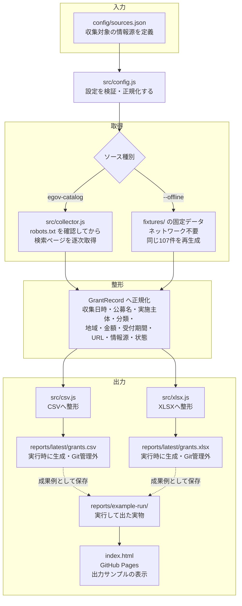

# Grant Info Collector 設計メモ

実装済み。e-Govデータポータル（デジタル庁）の公開カタログから、
補助金・助成金・入札公募に関するデータセット情報を収集して CSV / XLSX に出力する。
取得元の選定理由と規約確認の記録は `docs/compliance.md`、計測記録は `docs/measurement.md` を参照。

## 全体の流れ（図）

GitHub 上でそのまま図として表示される Mermaid 記法で示す。
ネットワークに接続できない環境向けに、外部アクセスを行わず
同梱した応答の写し（`fixtures/`）から同じ結果を再生成する経路（`--offline`）も含めている。

## 各段階の説明

| 段階 | 何をするか |
|---|---|
| **入力** | `config/sources.json` に、巡回する情報源（名前・種別・URL・分類・地域・認証要否）と、タイムアウトや出力形式などの実行設定（`settings`）をまとめて定義する。 |
| **検証** | `src/config.js` の `validateConfig` が設定の形式を検証する。認証が必要な情報源（`authRequired: true`）は、`settings.allowAuthenticatedSources` を明示的に有効化しない限り起動時に拒否する。 |
| **取得（実アクセス）** | `src/collector.js` の `collectFromSource(source)` が種別ごとのアダプタへ振り分ける。現在の実装は `egov-catalog`。実行のたびに `robots.txt`（ホスト直下とカタログ直下の両方）を取得し、`Crawl-delay` を守って**1本ずつ順番に**取得する。拒否されている経路へは接続しない。対象は `docs/compliance.md` で利用規約・`robots.txt` を事前確認した情報源に限る。 |
| **取得（通信なしの経路）** | `--offline` を付けると `fixtures/index.json` に保存した応答の写しを返す（`src/http.js` の `createOfflineFetcher`）。通信を遮断した環境でも、通信ありと同じ107件を再生成できることを確認済み。 |
| **整形** | 取得結果を `GrantRecord`（下表）の形へ正規化する。ソース種別によって元データの形が違っても、この段階で列の意味・順序をそろえる。 |
| **出力（CSV）** | `src/csv.js` が `GrantRecord[]` をCSVへ整形する。文字化け対策のBOM付与、スプレッドシート数式インジェクション対策（`=` `+` `-` `@` で始まるセルのエスケープ）を行う。 |
| **出力（XLSX）** | `src/xlsx.js` が同じ `GrantRecord[]` をXLSXへ整形する。 |
| **成果の保存** | 実行のたびに `reports/latest/` または `reports/runs/`（いずれもGit管理外）へ書き出す。公開用の実物は `reports/example-run/` に保存し、`index.html`（GitHub Pages）から参照する。 |
| **出典の記載** | `src/notice.js` が持つ出典・利用条件・加工主体の文言を、CSVの末尾行とXLSXの「出典・利用条件」シートへ必ず埋め込む。PDL1.0 が求める2つの義務（出典の記載／加工したことと主体の記載）に対応する。 |

## GrantRecord（収集結果1件の形）

`src/collector.js` にJSDocで定義。CSV・XLSXの出力列と1対1で対応させる。

| フィールド | 内容 |
|---|---|
| collected_at | 収集日時（ISO 8601） |
| title | 公募名 |
| organization | 実施主体 |
| category | 分類（例: 補助金 / 助成金） |
| region | 対象地域 |
| amount | 金額・上限額（テキストのまま） |
| application_start | 受付開始日 |
| application_deadline | 受付締切日 |
| url | 詳細ページURL |
| source | 情報源名 |
| status | 取得状態（ok / error） |
| summary | 概要（出典側の説明文） |
| data_formats | 公開されているデータ形式 |
| updated_at | 出典側の更新日 |

## 収集ロジックの構造

`src/collector.js` の `collectFromSource(source)` が、ソース種別（`type`）ごとのアダプタへ振り分ける。
現在の実装は `egov-catalog` の1種類。別の情報源を足す場合は `ADAPTERS` に追加すれば、
CLI・CSV/XLSX出力・テストはそのまま使える。

`egov-catalog` は2段構えで取得する。実施主体（府省）が検索結果の一覧に載らないためである。

1. キーワードだけで検索し、絞り込み候補として出てくる「組織」の一覧と件数を読む
2. 件数の多い組織から順に、組織で絞り込んだ検索を行い、各行の実施主体を確定させる

1回の実行で辿る組織数とページ数には上限を設けている（`config/sources.json` の
`maxOrganizations` / `maxPages`）。既定では1回の実行あたり14リクエストで終わる。

## 認証情報の扱い

- 既定（`settings.allowAuthenticatedSources: false`）では、`authRequired: true` の
  ソースを含む設定は起動時に拒否する（`src/config.js`）。
- 将来、認証が必要な情報源を扱う場合は、設定側で明示的に許可した上で、
  鍵は `.env` 経由で渡し、リポジトリには含めない（`config/*.example.json` に実値を書かない）。

## 今後の検討事項

- 定期実行（スケジューラ）の要否。現時点では含めていない
- 情報源の追加。追加するたびに `docs/compliance.md` へ規約確認の記録を残す前提とする
- ネットワーク境界の制御（許可ホストの限定・プロキシ経由の一本化）。
  現在の取得先は1ホストのみで、`robots.txt` の判定で経路を絞っているため、
  過剰な作り込みは避けている
